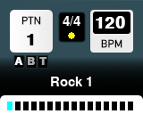

# carina-drummer
A drum loop player in Python.



Keys:

```
Q or Esc - quit
Left arrow - previous pattern
Right arrow - next pattern
Spacebar - play/pause
Plus - increase tempo
Minus - decrease tempo
```

This will eventually run on CircuitPython in a guitar pedal form factor.

The samples are from https://github.com/jstrait/beats and patterns are from https://github.com/montoyamoraga/drum-machine-patterns, using my script to convert them to YAML at https://github.com/tgerla/drum-machine-patterns. 
